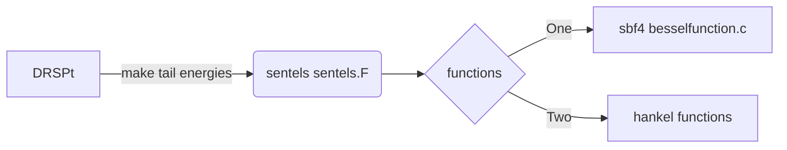

#  cannonical band calculation

#Input files (will add)

## Structure Constants 

There are currently three files:


### gaunt:

comparison with rspt. 


Gaunt coefficients 
Gaunt coefficients are initialized in DRSPt.F
It calls a function: init_cgaunt which is in cgaunt.F

The actual calculations for the gaunt coefficients are done in sgaunt.F
The factorials for the gaunt coefficients are done in sfact2_f and factir_f


### spherical:

describe spherical harmonic function

### factorial:

At the moment, this code is in fortran 77. To run,

```bash
gfortran -lgfortran -o factorial factorial.F
```

```bash
./factorial
```

## LMTO

## Cannonical bands 
